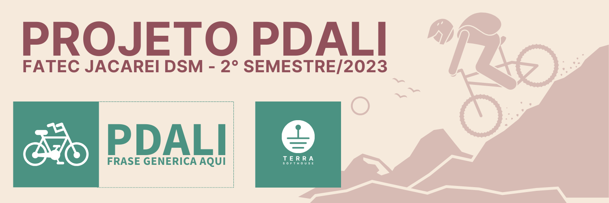

    

    

    <a href="#sobre">Sobre</a>  |  
    <a href="#backlogs">Backlogs</a>  |  
    <a href="#tecnologias">Tecnologias</a>  |  
    <a href="#equipe">Equipe</a>

    
    

    
## Sobre o projeto

O objetivo é desenvolver um aplicativo web peer-to-peer para conectar proprietários e pessoas interessadas em alugar bicicletas. A aplicação deverá 
apenas fazer a intermediação entre as partes sem qualquer responsabilidade sobre pagamento.

> _Projeto baseado na metodologia ágil SCRUM, procurando desenvolver a Proatividade, Autonomia, Colaboração e Entrega de Resultados dos estudantes envolvidos_
    

<a href=""><strong>Documentação</strong></a>   

Status do Projeto: **Em andamento** 🚧

### 🏁 Entregas de Sprints
Cada entrega foi realizada a partir da criação de uma branch neste repositório com um relatório completo de tudo o que foi desenvolvido naquela sprint. Observe a relação a seguir:
| Sprint | Previsão de entrega | Status           | Histórico |
|:--:|:----------:|:-------------------|:-------------------------------------------------:|
| 01 | 04/09/2023 | 🚧 Iniciado      |  [Relatório - Ainda não disponivel]() |
| 02 | Sem previsão | 🚧 Não iniciada     | [Relatório - Ainda não disponivel]() |
| 03 | Sem previsão | 🚧 Não iniciada   | [Relatório - Ainda não disponivel]() |

→ [Voltar ao topo](#topo)

## Backlogs
     

## 📅 Evolução do projeto:

→ [Voltar ao topo](#topo)
    

## 🛠️ Tecnologias

As seguintes ferramentas, linguagens, bibliotecas e tecnologias foram usadas na construção do projeto:

    

 
 
 
 
 
    
    
    

    
→ [Voltar ao topo](#topo)

## Equipe

    
     
    
    
    
    

    
    
|    Função     | Nome                                  |                                                                                                                                                      LinkedIn & GitHub                                                                                                                                                      |
| :-----------: | :------------------------------------ | :-------------------------------------------------------------------------------------------------------------------------------------------------------------------------------------------------------------------------------------------------------------------------------------------------------------------------: |
|   Product Owner    | Beatriz Roberto Montanini  |                        |
| Scrum Master  | Flavio Eduardo Linguanotto |             |
|   Dev Team    | Marcelo Eiji Torrieli                 |       |
|   Dev Team    |Juliana Maciel Manso                   |             |
| Dev Team |Kelvin Franco de Souza              |   | 
| Dev Team |  Igor Vinicius Santos Fonseca  |   | 
| Dev Team | Thiago Marinho Brito de Souza    |   | 

    
→ [Voltar ao topo](#topo)
